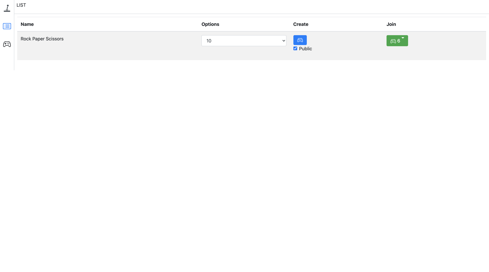
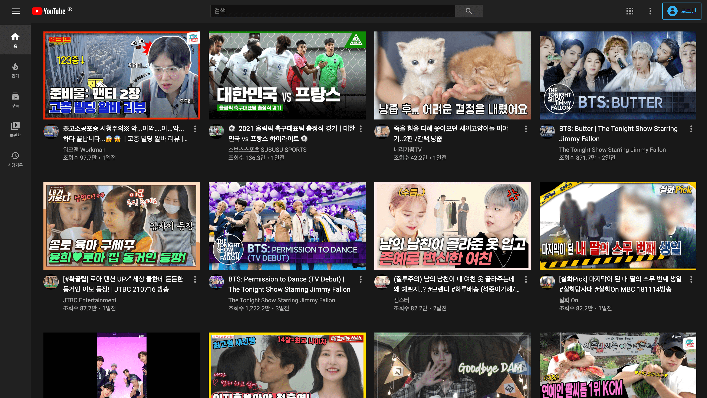
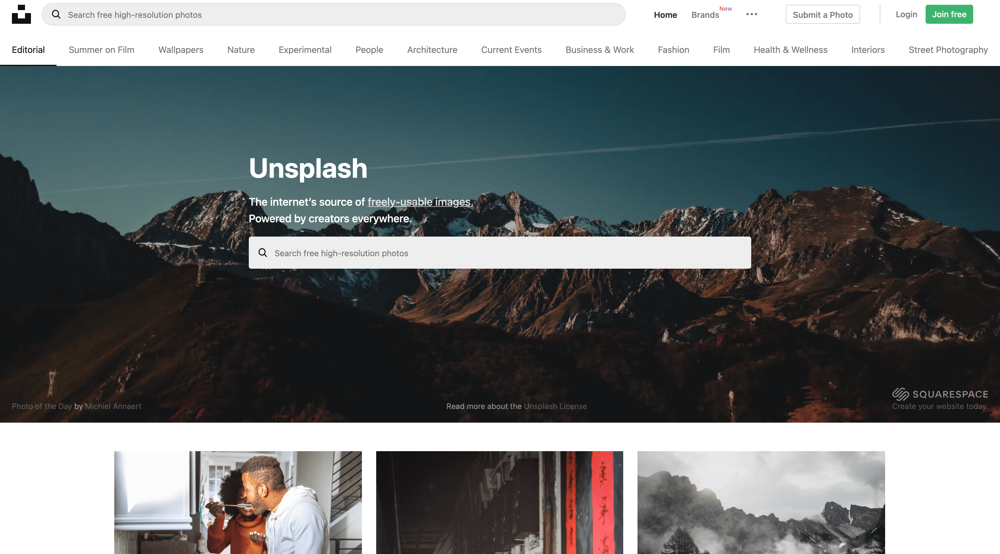

# 포트폴리오

### [냉장고 관리 웹 어플리케이션](https://github.com/bereal1995/refrigerators-alert)

- 냉장고 속 제품 유툥기한 관리를 도와주는 웹 어플리케이션 입니다.
- react, redux, redux-thunk, firebase, antd
- [프로젝트 구경하기](https://github.com/bereal1995/refrigerators-alert)

### [가위바위보 게임](https://github.com/bereal1995/games)

- 실시간으로 가위바위보 게임을 할 수 있는 가위바위보 게임 페이지입니다.
- react, redux, redux-thunk, firebase, bootstrap, styled-compoenets
- [프로젝트 구경하기](https://github.com/bereal1995/games)

### [youtube clone](https://github.com/bereal1995/youtube)

- 유튜브 API를 활용해서 만든 클론 사이트 입니다.
- react, redux, redux-saga, styled-components, react-google-login, firebase
- [프로젝트 구경하기](https://github.com/bereal1995/youtube)

### [unsplash clone](https://github.com/bereal1995/unsplash)

- unsplash api를 활용해서 만든 클론 사이트 입니다.
- react, redux, redux-saga, styled-components, react-google-login, firebase
- [프로젝트 구경하기](https://github.com/bereal1995/unsplash)